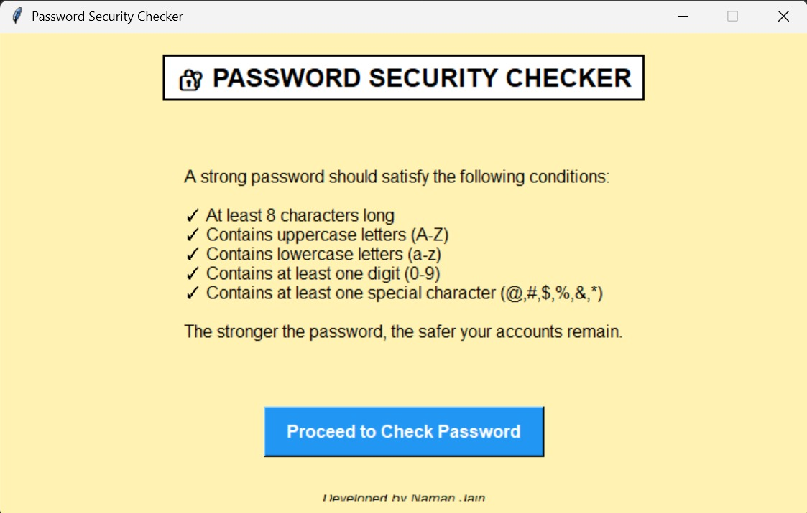
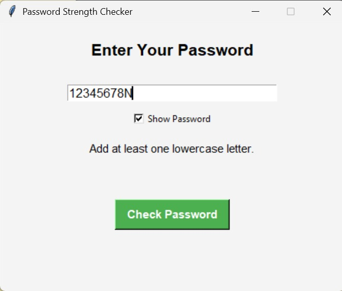
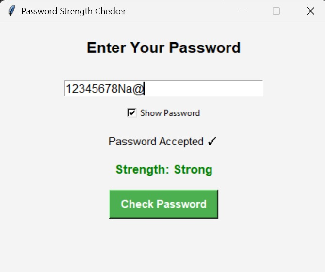

# 🔐 Password Security Checker System

## Overview

The **Password Security Checker System** is a desktop-based cybersecurity utility developed using **Python** and **Tkinter**. The application evaluates password strength against industry-standard security practices and provides instant feedback to help users create stronger, more secure passwords.

The system performs comprehensive password validation by analyzing multiple security parameters, including password length, character diversity, numerical complexity, and special character usage. Based on these checks, it classifies passwords into different security levels and highlights potential weaknesses.

This project demonstrates practical implementation of **GUI development, string processing, conditional logic, input validation, and cybersecurity fundamentals** using Python.

---

## ✨ Features

### 🔍 Password Validation

The application verifies whether a password satisfies essential security requirements:

* Minimum length validation
* Uppercase character detection
* Lowercase character detection
* Numeric digit verification
* Special character validation
* Empty input handling

### 📊 Password Strength Analysis

Passwords are categorized into different strength levels:

* ❌ Weak
* ⚠️ Moderate
* ✅ Strong

The strength evaluation is based on password complexity and compliance with recommended security standards.

### 🖥️ Interactive Graphical User Interface

Built using Python's Tkinter framework, the application offers:

* Clean and intuitive interface
* One-click password analysis
* Instant validation feedback
* Strength assessment display
* User-friendly interaction flow

### 🛡️ Security Awareness

The system encourages users to:

* Avoid weak passwords
* Use character combinations effectively
* Follow modern password creation practices
* Improve account security through stronger credentials

---

## 🛠️ Technologies Used

| Technology                  | Purpose                              |
| --------------------------- | ------------------------------------ |
| Python 3                    | Core Programming Language            |
| Tkinter                     | Graphical User Interface Development |
| Regular Expressions (Regex) | Password Pattern Validation          |
| String Processing           | Character Analysis                   |

---

## 🧠 Concepts Demonstrated

### GUI Programming

Implementation of interactive desktop applications using Tkinter components such as:

```python
Label
Entry
Button
Frame
MessageBox
```

### Input Validation

Validation logic for checking password complexity requirements.

```python
Length Validation
Uppercase Detection
Lowercase Detection
Digit Verification
Special Character Verification
```

### Conditional Logic

Decision-based strength classification using Python control structures.

### String Processing

Efficient character-by-character password analysis and pattern matching.

### Cybersecurity Fundamentals

Application of widely accepted password security guidelines and best practices.

---

## 📂 Project Structure

```text
PASSWORD_CHECKER_SYSTEM
│
├── src/
│   └── main.py
│
├── screenshots/
│   ├── home.png
│   ├── weak-password.png
│   └── strong-password.png
│
├── README.md
└── LICENSE
```

---

## ⚙️ Installation & Execution

### Clone Repository

```bash
git clone https://github.com/your-username/Password_checker_system.git
```

### Navigate to Project Directory

```bash
cd Password_checker_system
```

### Run Application

```bash
python src/main.py
```

---

## 📋 Password Evaluation Criteria

A secure password should:

✔ Contain at least 8 characters

✔ Include uppercase letters (A-Z)

✔ Include lowercase letters (a-z)

✔ Include numerical digits (0-9)

✔ Include special characters (! @ # $ % ^ & *)

Example:

```text
Naman@2026
```

Result:

```text
Strength: Strong
```

---

## 📸 Screenshots

### Home Screen



### Weak Password Detection



### Strong Password Detection



---

## 🚀 Future Enhancements

* Password Visibility Toggle
* Password Generator
* Entropy-Based Strength Calculation
* Breach Detection Integration (Have I Been Pwned API)
* Password History Analysis
* Multi-Language Support
* Dark Mode Interface
* Modern GUI using CustomTkinter
* Export Security Reports

---

## 🎯 Learning Outcomes

This project helped strengthen understanding of:

* Python GUI Development
* Event-Driven Programming
* User Input Validation
* Cybersecurity Best Practices
* String Manipulation Techniques
* Software Design Fundamentals
* Desktop Application Development

---

## 👨‍💻 Author

**Naman Jain**

Computer Science Engineering Student
IIIT Sonepat

Interested in Software Development, Artificial Intelligence, Cybersecurity, System Design, and Building Real-World Applications.

---

## 📜 License

This project is licensed under the MIT License.

---

## ⭐ Support

If you found this project useful, consider giving the repository a ⭐ on GitHub.

Your support motivates further open-source development and future improvements.

